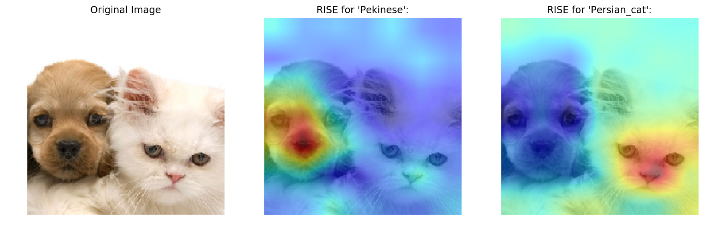

# Implementation of "RISE: Randomized Input Sampling for Explanation of Black-box Models"

https://arxiv.org/pdf/1806.07421.pdf

by Vitali Petsiuk <vpetsiuk@bu.edu>, Abir Das <dasabir@bu.edu>, Kate Saenko <saenko@bu.edu>

 

